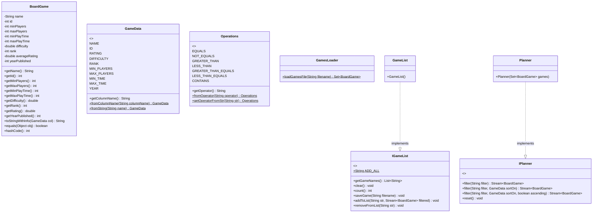
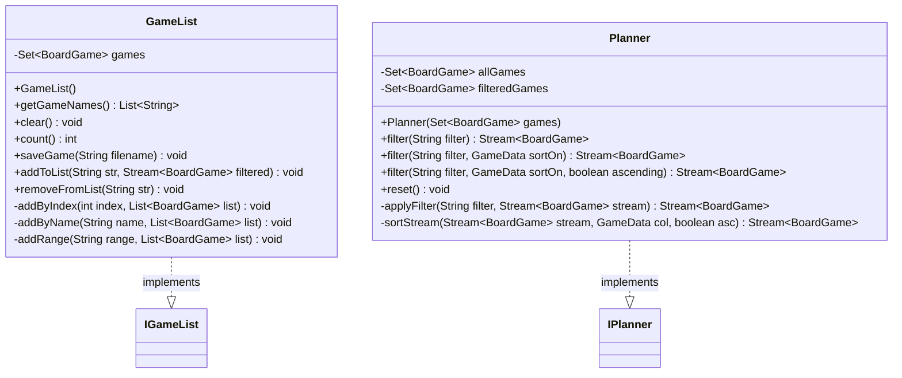
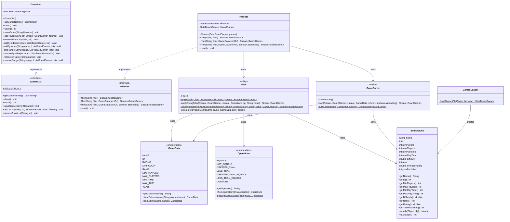

# Board Game Arena Planner Design Document

This document is meant to provide a tool for you to demonstrate the design process. You need to work on this before you code, and after have a finished product. That way you can compare the changes, and changes in design are normal as you work through a project. It is contrary to popular belief, but we are not perfect our first attempt. We need to iterate on our designs to make them better. This document is a tool to help you do that.

If you are using mermaid markup to generate your class diagrams, you may edit this document in the sections below to insert your markup to generate each diagram. Otherwise, you may simply include the images for each diagram requested below in your zipped submission (be sure to name each diagram image clearly in this case!)

## (INITIAL DESIGN): Class Diagram

Include a UML class diagram of your initial design for this assignment. If you are using the mermaid markdown, you may include the code for it here. For a reminder on the mermaid syntax, you may go [here](https://mermaid.js.org/syntax/classDiagram.html)

### Provided Code

Provide a class diagram for the provided code as you read through it.  For the classes you are adding, you will create them as a separate diagram, so for now, you can just point towards the interfaces for the provided code diagram.

### Your Plans/Design

Create a class diagram for the classes you plan to create. This is your initial design, and it is okay if it changes. Your starting points are the interfaces.

## (INITIAL DESIGN): Tests to Write - Brainstorm

Write a test (in english) that you can picture for the class diagram you have created. This is the brainstorming stage in the TDD process.

> [!TIP]
> As a reminder, this is the TDD process we are following:
> 1. Figure out a number of tests by brainstorming (this step)
> 2. Write **one** test
> 3. Write **just enough** code to make that test pass
> 4. Refactor/update  as you go along
> 5. Repeat steps 2-4 until you have all the tests passing/fully built program

You should feel free to number your brainstorm.

1. testFilterNameEquals — filtering `name == Go` should return exactly 1 game named "Go".
2. testFilterNameContains — filtering `name ~= go` should return all games whose name contains "go" (case-insensitive).
3. testFilterMinPlayersGreaterThan — `minPlayers > 5` should return only games with minPlayers above 5.
4. testFilterRatingGreaterThanOrEqual — `rating >= 9.0` should return only games with a rating of 9.0 or higher.
5. testFilterMultipleFiltersAnd — a comma-separated filter like `minPlayers > 1, maxPlayers < 6` should apply both conditions together.
6. testResetRestoresAllGames — after applying a filter, calling reset() should restore the full game collection.
7. testFilterEmptyStringReturnsSortedByName — calling filter("") should return all current games sorted A-Z by name.
8. testFilterSortByRatingDescending — sorting by RATING descending should put the highest-rated game first.
9. testGameListStartsEmpty — a newly constructed GameList should have a count of 0.
10. testAddAllToList — addToList("all", stream) should add every game from the filtered stream to the list.
11. testAddByName — addToList with a game name should add just that one matching game.
12. testAddByIndex — addToList with a number like "1" should add the first game in the filtered stream.
13. testAddByRange — addToList with a range like "1-3" should add the first 3 games from the filtered stream.
14. testGetGameNamesSortedOrder — getGameNames() should always return names in ascending alphabetical order ignoring case.
15. testRemoveByName — removeFromList with a game name should remove only that game from the list.

## (FINAL DESIGN): Class Diagram

Go through your completed code, and update your class diagram to reflect the final design. It is normal that the two diagrams don't match! Rarely (though possible) is your initial design perfect.

For the final design, you just need to do a single diagram that includes both the original classes and the classes you added.

> [!WARNING]
> If you resubmit your assignment for manual grading, this is a section that often needs updating. You should double check with every resubmit to make sure it is up to date.

## (FINAL DESIGN): Reflection/Retrospective

> [!IMPORTANT]
> The value of reflective writing has been highly researched and documented within computer science, from learning to information to showing higher salaries in the workplace. For this next part, we encourage you to take time, and truly focus on your retrospective.

> My initial design placed all filtering and sorting logic directly inside `Planner` with private helper methods handling those responsibilities, but as I began implementing it became clear that this approach was making `Planner` too large and too difficult to test in isolation, which led me to extract two utility classes that were not part of my original design at all: `Filter` to handle parsing and application of a single filter expression, and `GameSorter` to encapsulate all comparator building logic for sorting streams by any `GameData` column. 
> 
> One of the most significant lessons I learned was how subtle bugs can hide in seemingly simple decisions, for example I initially called `replaceAll(" ", "")` to remove all spaces from the filter string before parsing it which worked fine for numeric filters like `"minPlayers >= 2"` but silently broke name filters like `"name ~= go fish"` by collapsing the value to `"gofish"`, and I also ran into an issue where my `TreeSet` comparator used a different ordering contract than `BoardGame`'s `equals` and `hashCode` methods causing unpredictable behavior that I resolved by switching to a `HashSet` with explicit sorting in `getGameNames()` and `removeFromList()`. If I were to start over I would design the helper classes from the beginning rather than discovering the need for them midway through, and I would write more targeted edge case tests earlier in the TDD process, particularly around values that contain spaces and case insensitive comparisons, since the most challenging part of this entire project was debugging the sorting inconsistency where the logic looked correct at every level individually but the interaction between the collection's ordering and equality contracts was causing silent failures that were hard to trace.
