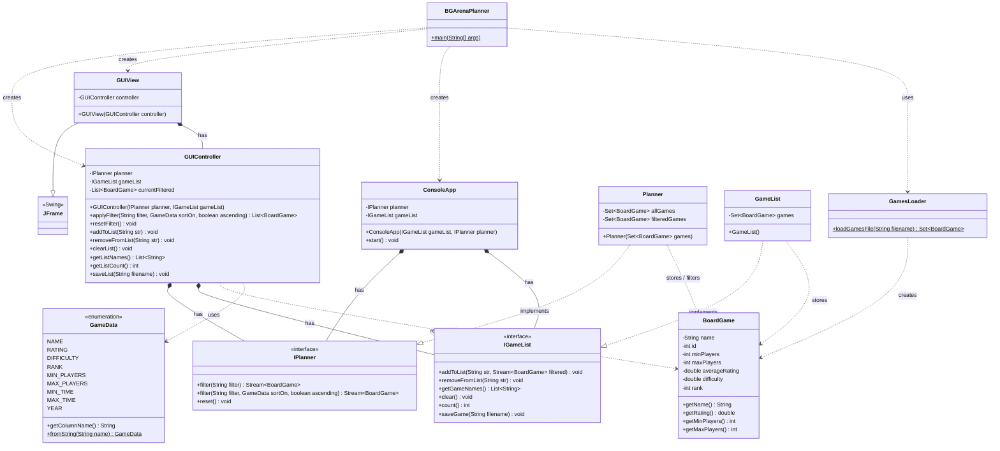

# Domain Name Information  Part 2 - Design Document

This document is meant to provide a tool for you to demonstrate the design process. You need to work on this before you code, and after have a finished product. That way you can compare the changes, and changes in design are normal as you work through a project. It is contrary to popular belief, but we are not perfect our first attempt. We need to iterate on our designs to make them better. This document is a tool to help you do that.

## (INITIAL DESIGN): Class Diagram

Place your class diagram below. If you are using the mermaid markdown, you may include the code for it here. For a reminder on the mermaid syntax, you may go [here](https://mermaid.js.org/syntax/classDiagram.html)

## (INITIAL DESIGN): Tests to Write - Brainstorm

Write a test (in english) that you can picture for the class diagram you have created. This is the brainstorming stage in the TDD process. 

> [!TIP]
> As a reminder, this is the TDD process we are following:
> 1. Figure out a number of tests by brainstorming (this step)
> 2. Write **one** test
> 3. Write **just enough** code to make that test pass
> 4. Refactor/update  as you go along
> 5. Repeat steps 2-4 until you have all the tests passing/fully built program

You should feel free to number your brainstorm. 

1. **controllerListStartsEmpty**: a freshly constructed controller should have `getListCount()` return 0 before any games are added.
2. **controllerAddGameByName**: after calling `applyFilter` to get a result set, calling `addToList` with a valid game name should increase the list count by one.
3. **controllerAddAllGamesFromFilter**: calling `addToList("all")` should add every game in the current filtered result to the personal list.
4. **controllerAddGameByPosition**: calling `addToList("1")` should add the first game from the current filtered result to the personal list.
5. **controllerAddInvalidNameThrowsException**:  calling `addToList` with a name that does not exist in the current filter should throw an `IllegalArgumentException`.
6. **controllerRemoveGameByName**: after adding a game, calling `removeFromList` with its name should remove it and reduce the count by one.
7. **controllerRemoveGameNotInListThrows**: calling `removeFromList` with a name that was never added should throw an `IllegalArgumentException`.
8. **controllerClearRemovesAllGames**: after adding multiple games, calling `clearList()` should leave `getListCount()` at zero.
9. **controllerListNamesAlphabetical**: `getListNames()` should always return names sorted A-Z, regardless of the order games were added.
10. **controllerNoDuplicatesInList**: adding the same game twice should not increase the count beyond one.
11. **controllerEmptyFilterReturnsFullCollection**: calling `applyFilter("", NAME, true)` on a fresh controller should return all games sorted A-Z by name.
12. **controllerFilterByMinPlayersFloor**: `applyFilter("minPlayers>=4", NAME, true)` should return only games where `minPlayers` is 4 or more.
13. **controllerFilterByNamePartialMatch**: `applyFilter("name~=catan", NAME, true)` should return only games whose name contains "catan", case-insensitively.
14. **controllerFiltersStackWithoutReset**: calling `applyFilter` twice in a row without calling `resetFilter` should narrow the results further each time.
15. **controllerResetRestoresFullCollection**: after applying a narrow filter, calling `resetFilter()` followed by `applyFilter("")` should return the original total game count.
16. **controllerSortDescendingPutsHighestFirst**: `applyFilter("", RATING, false)` should return the highest-rated game as the first element in the list.

## (FINAL DESIGN): Class Diagram

Go through your completed code, and update your class diagram to reflect the final design. It is normal that the two diagrams don't match! Rarely (though possible) is your initial design perfect. 

> [!WARNING]
> If you resubmit your assignment for manual grading, this is a section that often needs updating. You should double check with every resubmit to make sure it is up to date.

```mermaid
classDiagram
    direction TB
 
%% ── ENTRY POINT ───────────────────────────────────────────────────────────
    class BGArenaPlanner {
        -String DEFAULT_COLLECTION$
        +main(String[] args)$
    }
 
%% ── VIEW LAYER ────────────────────────────────────────────────────────────
    class JFrame {
        <<Swing>>
    }
 
    class GUIView {
        -GUIController controller
        -JTextField filterField
        -JComboBox~GameData~ sortCombo
        -JCheckBox ascendingCheck
        -JLabel statusLabel
        -JTable resultsTable
        -DefaultTableModel resultsModel
        -DefaultListModel~String~ listModel
        -JList~String~ myList
        -JLabel listCountLabel
        +GUIView(GUIController controller)
        -applyFilter() void
        -resetFilter() void
        -addSelectedGames() void
        -addAllGames() void
        -removeSelectedFromList() void
        -clearList() void
        -saveList() void
        -refreshResultsTable(List~BoardGame~ games) void
        -refreshMyList() void
        -makeButton(String text, Color color)$ JButton
    }
 
    class ConsoleApp {
        -IPlanner planner
        -IGameList gameList
        +ConsoleApp(IGameList gameList, IPlanner planner)
        +start() void
    }
 
%% ── CONTROLLER LAYER ──────────────────────────────────────────────────────
    class GUIController {
        -IPlanner planner
        -IGameList gameList
        -List~BoardGame~ currentFiltered
        +GUIController(IPlanner planner, IGameList gameList)
        +applyFilter(String filter, GameData sortOn, boolean ascending) List~BoardGame~
        +resetFilter() void
        +addToList(String str) void
        +removeFromList(String str) void
        +clearList() void
        +getListNames() List~String~
        +getListCount() int
        +saveList(String filename) void
    }
 
%% ── MODEL LAYER: INTERFACES ───────────────────────────────────────────────
    class IPlanner {
        <<interface>>
        +filter(String filter) Stream~BoardGame~
        +filter(String filter, GameData sortOn, boolean ascending) Stream~BoardGame~
        +reset() void
    }
 
    class IGameList {
        <<interface>>
        +addToList(String str, Stream~BoardGame~ filtered) void
        +removeFromList(String str) void
        +getGameNames() List~String~
        +clear() void
        +count() int
        +saveGame(String filename) void
    }
 
%% ── MODEL LAYER: IMPLEMENTATIONS ─────────────────────────────────────────
    class Planner {
        -Set~BoardGame~ allGames
        -Set~BoardGame~ filteredGames
        +Planner(Set~BoardGame~ games)
        +filter(String filter, GameData sortOn, boolean ascending) Stream~BoardGame~
        +reset() void
    }
 
    class GameList {
        -Set~BoardGame~ games
        +GameList()
        +addToList(String str, Stream~BoardGame~ filtered) void
        +removeFromList(String str) void
        +getGameNames() List~String~
        +count() int
        +saveGame(String filename) void
    }
 
%% ── MODEL LAYER: DATA AND UTILITIES ──────────────────────────────────────
    class BoardGame {
        -String name
        -int id
        -int minPlayers
        -int maxPlayers
        -int minPlayTime
        -int maxPlayTime
        -double averageRating
        -double difficulty
        -int rank
        -int yearPublished
        +getName() String
        +getRating() double
        +getDifficulty() double
        +getRank() int
        +getMinPlayers() int
        +getMaxPlayers() int
        +getYearPublished() int
        +equals(Object obj) boolean
        +hashCode() int
    }
 
    class GameData {
        <<enumeration>>
        NAME
        ID
        RATING
        DIFFICULTY
        RANK
        MIN_PLAYERS
        MAX_PLAYERS
        MIN_TIME
        MAX_TIME
        YEAR
        +getColumnName() String
        +fromString(String name)$ GameData
    }
 
    class Operations {
        <<enumeration>>
        EQUALS
        NOT_EQUALS
        GREATER_THAN
        LESS_THAN
        GREATER_THAN_EQUALS
        LESS_THAN_EQUALS
        CONTAINS
        +getOperator() String
        +getOperatorFromStr(String str)$ Operations
    }
 
    class Filter {
        <<utility>>
        +apply(String filter, Stream~BoardGame~ games)$ Stream~BoardGame~
    }
 
    class GameSorter {
        <<utility>>
        +sort(Stream~BoardGame~ stream, GameData col, boolean ascending)$ Stream~BoardGame~
    }
 
    class GamesLoader {
        <<utility>>
        +loadGamesFile(String filename)$ Set~BoardGame~
    }
 
%% ── RELATIONSHIPS ─────────────────────────────────────────────────────────
 
    BGArenaPlanner ..> GUIController  : creates
    BGArenaPlanner ..> GUIView        : creates
    BGArenaPlanner ..> ConsoleApp     : creates
    BGArenaPlanner ..> GamesLoader    : uses
 
    GUIView --|> JFrame               : extends
    GUIView *-- GUIController         : has
    GUIView ..> GameData              : uses
    GUIView ..> BoardGame             : displays
 
    ConsoleApp *-- IPlanner           : has
    ConsoleApp *-- IGameList          : has
 
    GUIController *-- IPlanner        : has
    GUIController *-- IGameList       : has
    GUIController ..> BoardGame       : returns List
    GUIController ..> GameData        : uses
 
    Planner  ..|> IPlanner            : implements
    Planner  *-- Filter               : has
    Planner  *-- GameSorter           : has
    Planner  ..> BoardGame            : stores / filters
    Planner  ..> GameData             : uses
 
    GameList ..|> IGameList           : implements
    GameList ..> BoardGame            : stores
 
    Filter   ..> Operations           : uses
    Filter   ..> GameData             : uses
    Filter   ..> BoardGame            : filters
 
    GameSorter ..> GameData           : uses
    GameSorter ..> BoardGame          : sorts
 
    GamesLoader ..> BoardGame         : creates
```

## (FINAL DESIGN): Reflection/Retrospective

> [!IMPORTANT]
> The value of reflective writing has been highly researched and documented within computer science, from learning to information to showing higher salaries in the workplace. For this next part, we encourage you to take time, and truly focus on your retrospective.

Take time to reflect on how your design has changed. Write in *prose* (i.e. do not bullet point your answers - it matters in how our brain processes the information). Make sure to include what were some major changes, and why you made them. What did you learn from this process? What would you do differently next time? What was the most challenging part of this process? For most students, it will be a paragraph or two. 

> Coming into this assignment, I felt like I had a solid plan. The existing code already had a clean separation between the model and the console view, which meant I could build on top of it without tearing anything apart. The controller would sit in the middle, the view would handle the visuals, and BGArenaPlanner would route between the two modes. Simple enough in theory. But the closer I got to actually implementing it, the more I realized the plan had gaps I had not accounted for. The most significant one was deciding where to store the current filtered list. My first instinct was to have the view pass it back to the controller whenever the user wanted to add a game, but that would have put model state in the view, which completely defeats the purpose of MVC. Moving currentFiltered into the controller fixed that, and it also made the controller independently testable, which is what made the TDD process work. Writing one test at a time felt unnatural at first, almost like writing the conclusion of a paper before doing the research, but working through all 16 tests in order forced me to build the controller the right way and made it impossible to add anything unnecessary.
>
> If I were to do this again, I would budget more time for the view layer. The logic was straightforward but the Swing details accumulated faster than I expected, and the colorful redesign came late in the process because I had focused so heavily on getting the functionality right first. By the time I circled back to the visuals I was already running low on time for polish. The core lesson I am walking away with is that design is never truly finished on the first attempt, and being willing to revisit and refactor is not a sign of failure but rather the whole point of the process.
