# Testing History

When it comes to testing gui's you often have to document how you tested, and what you did. Use this document to document including screen shots of your testing.

---

## Test 1: Application Launch

I wanted to make sure the app loads all the games automatically when it first opens, without the user having to do anything.

I ran `./gradlew run --args="-g"` and just waited to see what happened.

I expected all 753 games to show up in the Search Results table sorted A to Z, and My Game List to start empty.

That is exactly what happened. All 753 games loaded right away starting with "13 Clues" and My Game List showed "0 games in list".

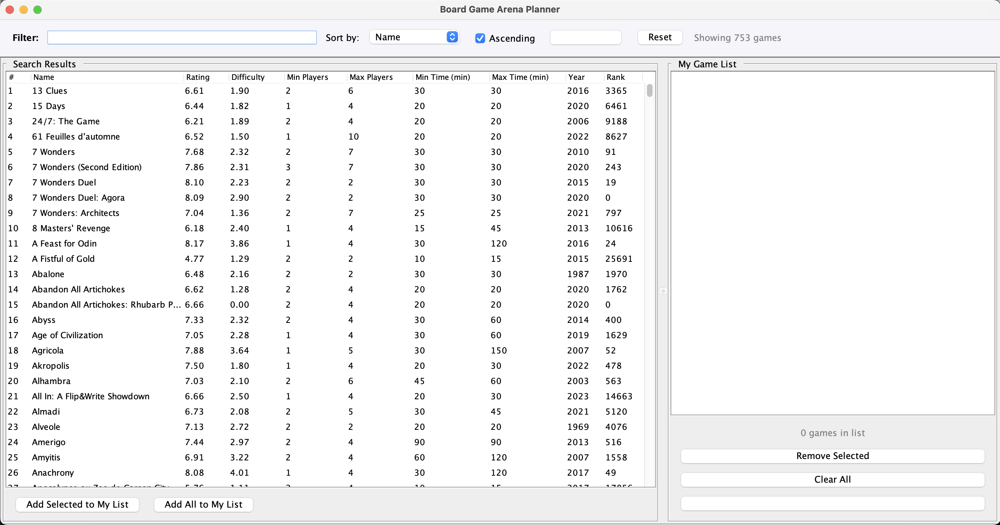
 
---

## Test 2: Filter by Name Using Contains Operator

I wanted to test that the name filter works and that it handles case insensitive matching correctly.

I typed `name~=catan` in the filter field and clicked Apply Filter.

I expected only games with "catan" in the name to show up, even though the filter is lowercase and the game is stored as "CATAN" in all caps.

It returned exactly 1 game which was CATAN, and the status bar updated to "Showing 1 game". The case insensitive matching worked correctly.

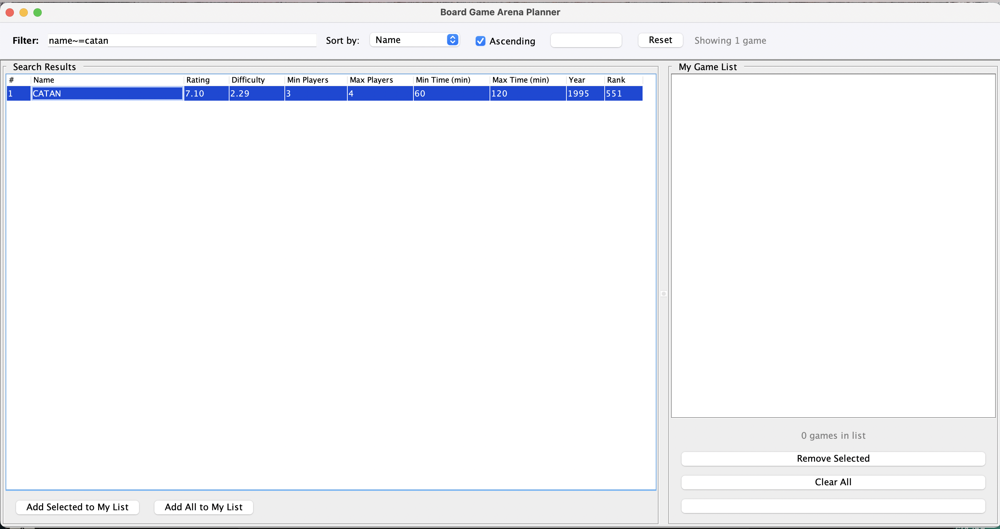
 
---

## Test 3: Filter by Name on a Different Game

I wanted to confirm the name filter works on more than just one specific game so I tried a different one.

I typed `name~=agricola` and clicked Apply Filter.

I expected only Agricola to show up.

It returned 1 game which was Agricola. This confirmed the filter is not hardcoded to one name and works generally.

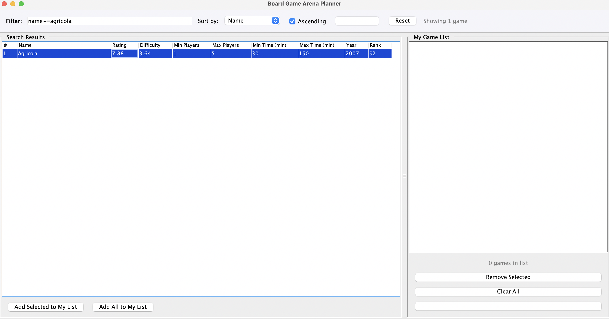
 
---

## Test 4: Sort by Rating Descending

I wanted to test that the sort dropdown and the ascending checkbox both work together correctly.

I changed Sort by to Rating, unchecked Ascending, and clicked Apply Filter with an empty filter field.

I expected the highest rated games to appear at the top of the list.

SPYBAM showed up first with a rating of 10.00, followed by Trasteros Locos: Crazy Auctions at 8.73 and Ark Nova at 8.54. The descending sort worked correctly.

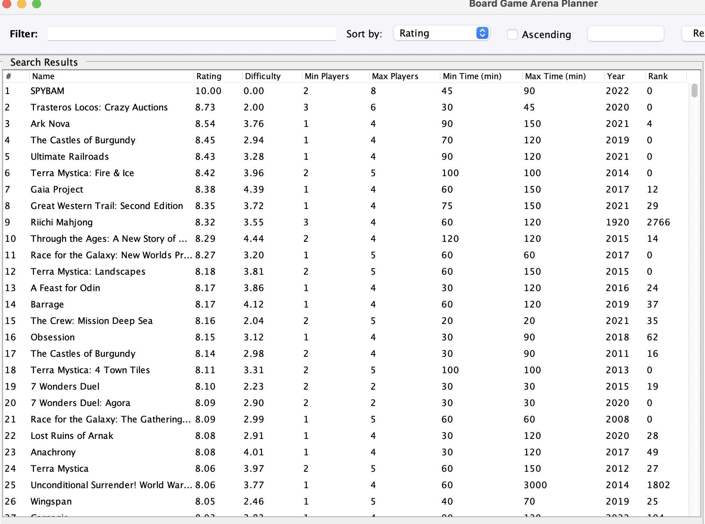
 
---

## Test 5: Add a Selected Game to My List

I wanted to test that clicking a row and then clicking Add Selected to My List actually adds that specific game.

I selected Agricola from the results table and clicked Add Selected to My List.

I expected Agricola to appear in My Game List with the count updating to "1 game in list".

Agricola showed up immediately in My Game List and the count updated correctly.

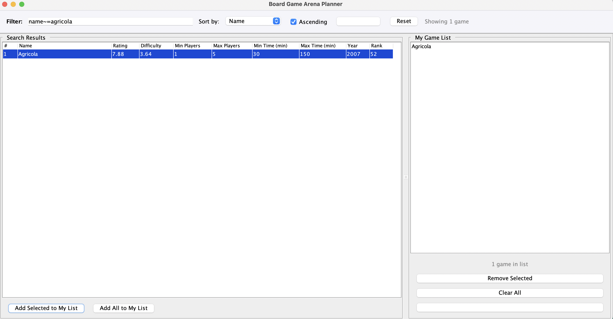
 
---

## Test 6: Add All Games to My List

I wanted to test the Add All button and make sure it adds everything currently showing in the results.

I clicked Add All to My List while all 753 games were in the Search Results table.

I expected all 753 games to be added to My Game List sorted A to Z.

All 753 games appeared in My Game List sorted alphabetically and the count showed "753 games in list".

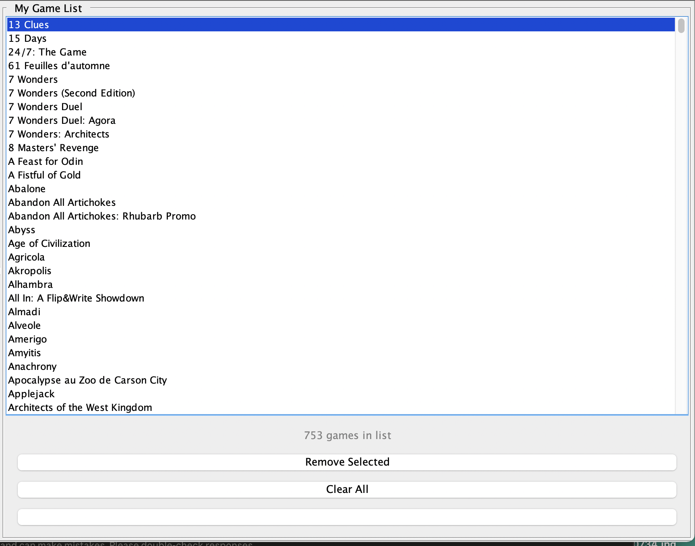
 
---

## Test 7: Remove a Selected Game from My List

I wanted to test that I can remove a specific game from My Game List without affecting the others.

I selected 13 Clues from My Game List and clicked Remove Selected.

I expected 13 Clues to be gone and the count to drop from 753 to 752, with the list now starting at 15 Days.

13 Clues was removed, the list started with 15 Days, and the count updated to "752 games in list".

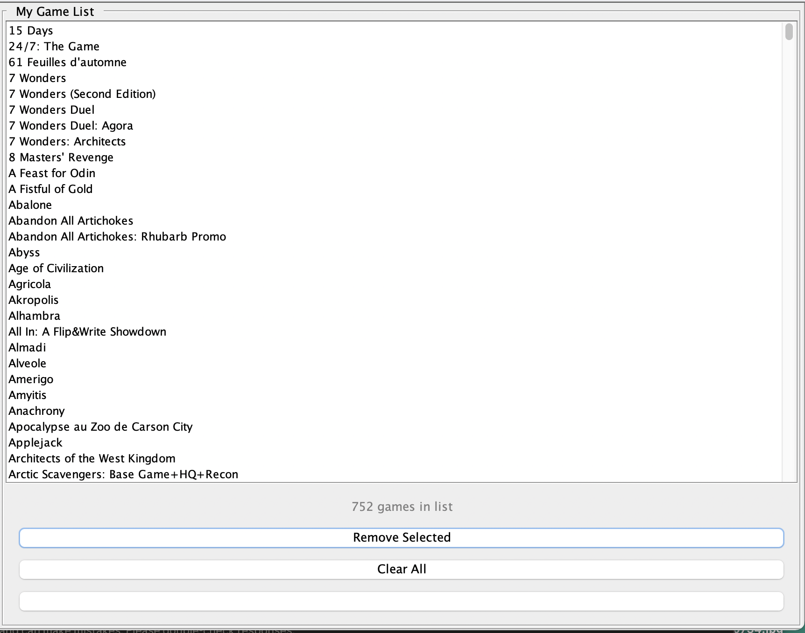
 
---

## Test 8: Clear All Confirmation Dialog

I wanted to test that clicking Clear All shows a confirmation dialog before doing anything destructive.

I clicked Clear All with 752 games in My Game List.

I expected a dialog to pop up asking me to confirm before anything gets deleted.

The dialog appeared and said "Remove all 752 games from your list?" with Yes and No buttons. It showed the correct count which means it is pulling the real number from the model.

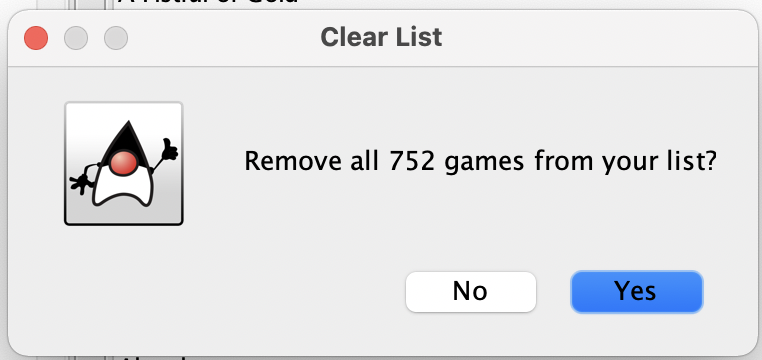
 
---

## Test 9: Clear All Actually Empties the List

I wanted to confirm that clicking Yes in the dialog actually clears everything.

I clicked Yes in the confirmation dialog.

I expected My Game List to be completely empty with the count showing "0 games in list".

The list was cleared and the count updated to "0 games in list".

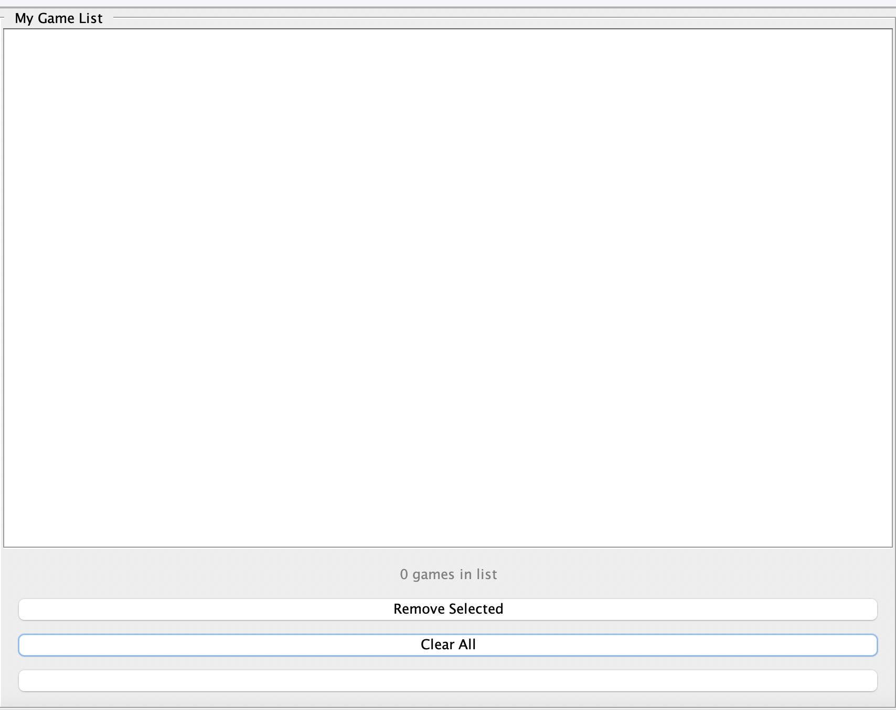
 
---

## Test 10: Save List File Dialog

I wanted to test that the save button opens a proper file dialog and defaults to a reasonable filename.

I added some games to My Game List then clicked Save List.

I expected a file chooser to open with "Save Game List" as the title and games_list.txt as the default filename.

The dialog opened correctly with the right title and default filename. I navigated to the Desktop and clicked Save.

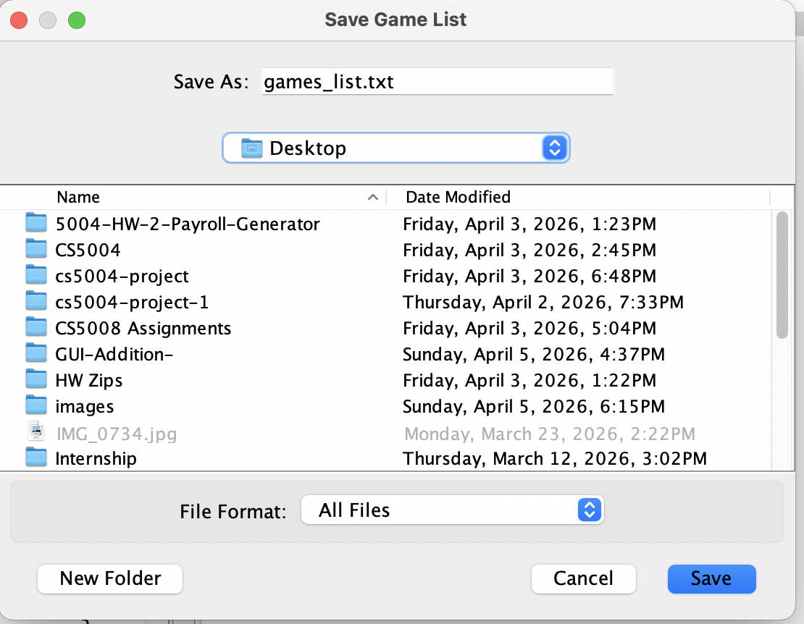
 
---

## Test 11: Save Confirmation and File Contents

I wanted to verify that the file actually gets saved and that the contents are correct.

After saving I checked both the confirmation dialog and opened the saved file.

I expected a confirmation showing the full file path, and the file to contain each game name on its own line sorted A to Z.

The confirmation showed `/Users/anamwork/Desktop/games_list.txt` and opening the file confirmed the names were saved one per line in alphabetical order.

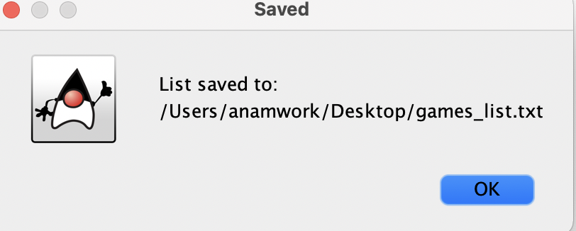

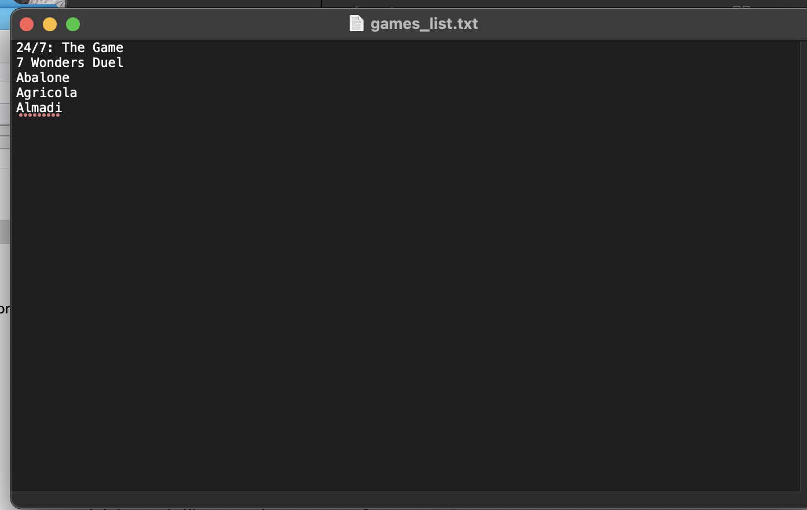
