# Testing History

When it comes to testing gui's you often have to document how you tested, and what you did. Use this document to document including screen shots of your testing.

---
## Test 1: Application Launch

I wanted to make sure the app loads all the games automatically when it first opens, without the user having to do anything.

I ran `./gradlew run --args="-g"` and just waited to see what happened.

I expected all 753 games to show up in the Search Results table sorted A to Z, and My Game List to start empty.

That is exactly what happened. All 753 games loaded right away starting with "13 Clues" and My Game List showed "0 games in list".

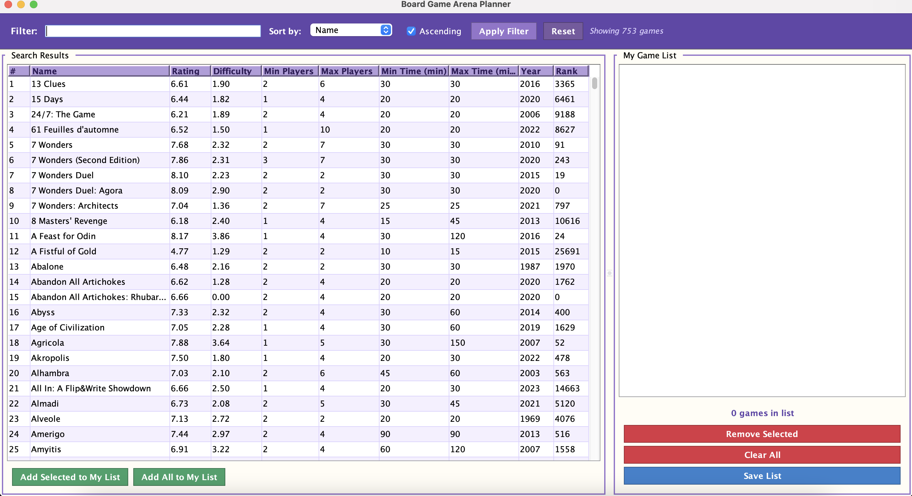

---

## Test 2: Filter by Name Using Contains Operator

I wanted to test that the name filter works and that it handles case insensitive matching correctly.

I typed `name~=dungeon` in the filter field and clicked Apply Filter.

I expected only games with "dungeon" in the name to show up regardless of capitalization.

It returned 6 games containing dungeon in the name and the status bar updated to "Showing 6 games". The case insensitive matching worked correctly.

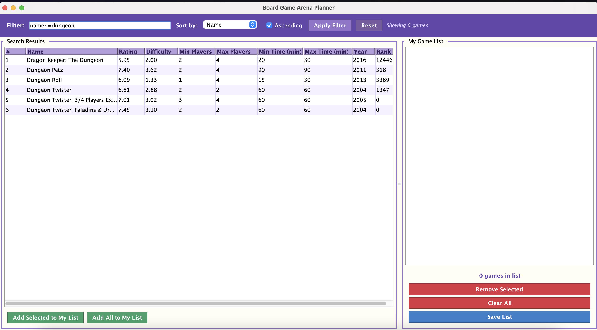

---

## Test 3: Sort by Rating Descending

I wanted to test that the sort dropdown and the ascending checkbox both work together correctly.

I changed Sort by to Rating, unchecked Ascending, and clicked Apply Filter with the dungeon filter still active.

I expected the dungeon games to be reordered from highest to lowest rating.

The results reordered with Dungeon Twister: Paladins at 7.45 appearing first. The descending sort worked correctly.

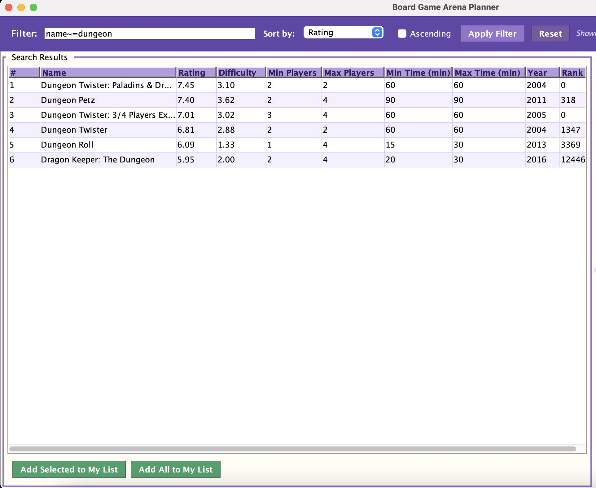

---

## Test 4: Add a Selected Game to My List

I wanted to test that clicking a row and then clicking Add Selected to My List actually adds that specific game.

I clicked Reset to go back to all games, selected 13 Clues from the results table and clicked Add Selected to My List.

I expected 13 Clues to appear in My Game List with the count updating to "1 game in list".

13 Clues showed up immediately in My Game List and the count updated correctly.

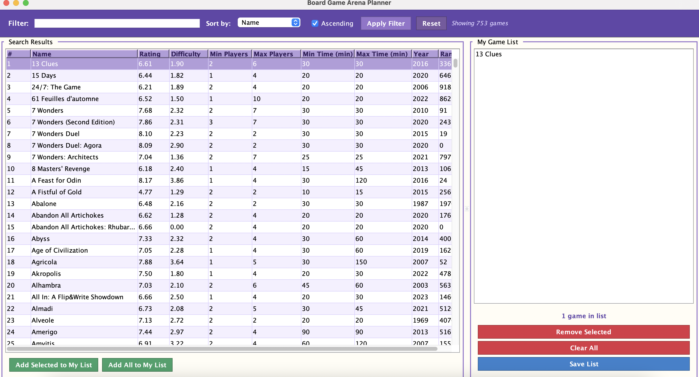

---

## Test 5: Add All Games to My List

I wanted to test the Add All button and make sure it adds everything currently showing in the results.

I clicked Add All to My List while all 753 games were in the Search Results table.

I expected all 753 games to be added to My Game List sorted A to Z.

All 753 games appeared in My Game List sorted alphabetically and the count showed "753 games in list".

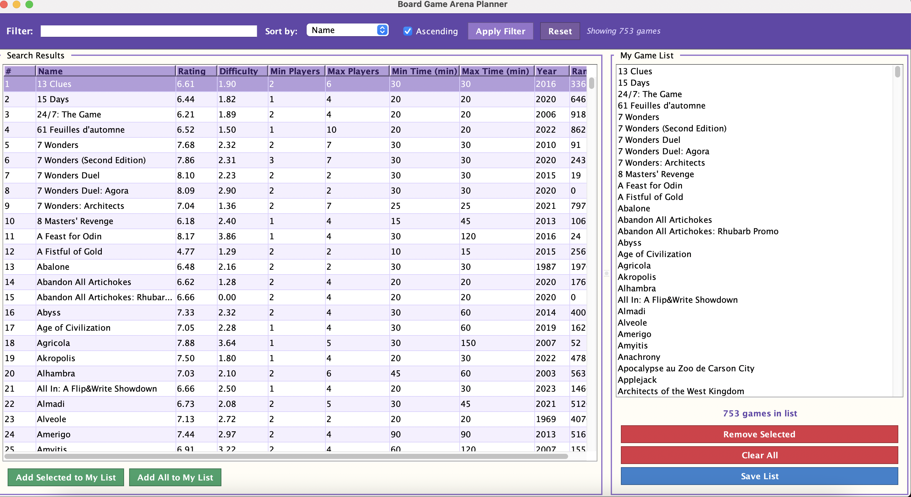

---

## Test 6: Remove a Selected Game from My List

I wanted to test that I can remove a specific game from My Game List without affecting the others.

I selected 13 Clues from My Game List and clicked Remove Selected.

I expected 13 Clues to be gone and the count to drop from 753 to 752.

Before removing:

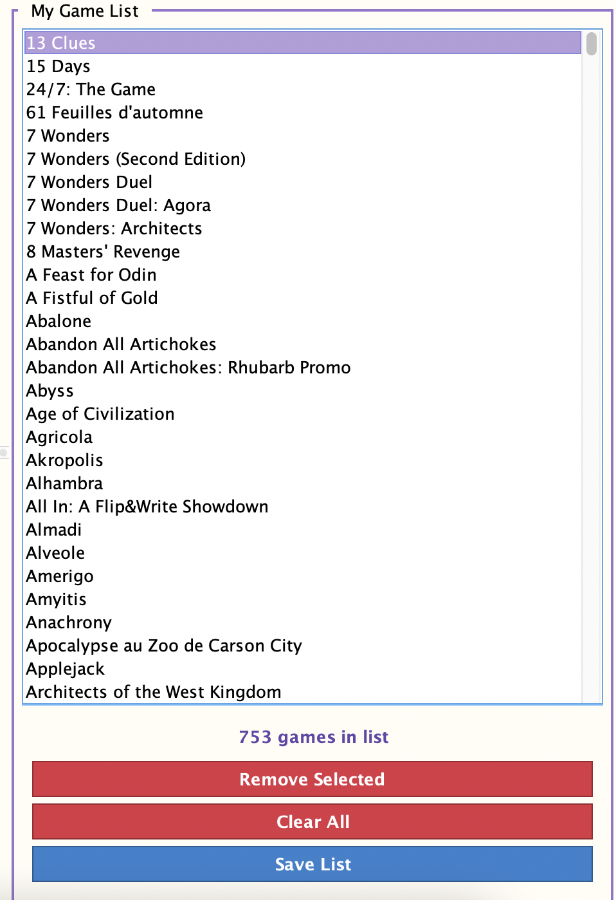

After removing 13 Clues the list started with 15 Days and the count updated to "752 games in list".

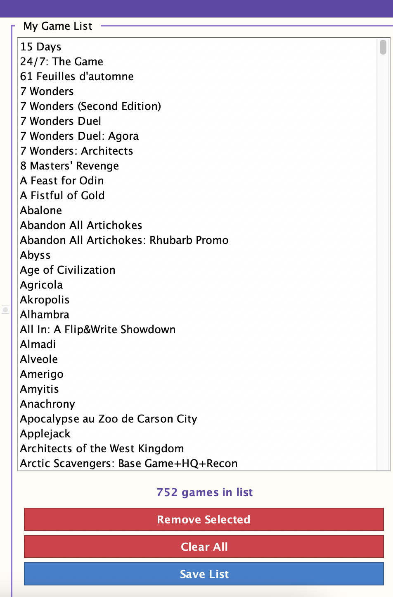

---

## Test 7: Clear All Confirmation Dialog

I wanted to test that clicking Clear All shows a confirmation dialog before doing anything destructive.

I clicked Clear All with 752 games in My Game List.

I expected a dialog to pop up asking me to confirm before anything gets deleted.

The dialog appeared and said "Remove all 752 games from your list?" with Yes and No buttons. It showed the correct count which means it is pulling the real number from the model.

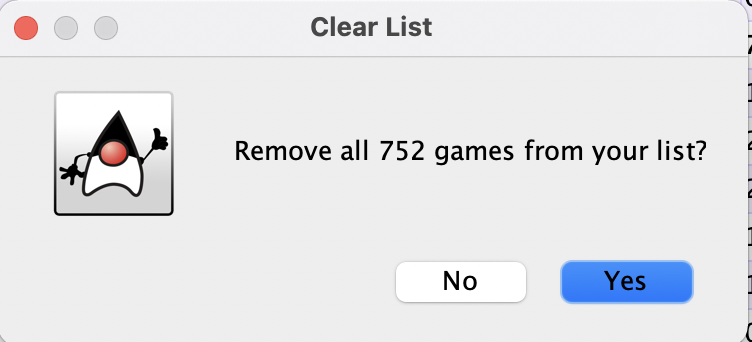

---

## Test 8: Clear All Actually Empties the List

I wanted to confirm that clicking Yes in the dialog actually clears everything.

I clicked Yes in the confirmation dialog.

I expected My Game List to be completely empty with the count showing "0 games in list".

The list was cleared and the count updated to "0 games in list".

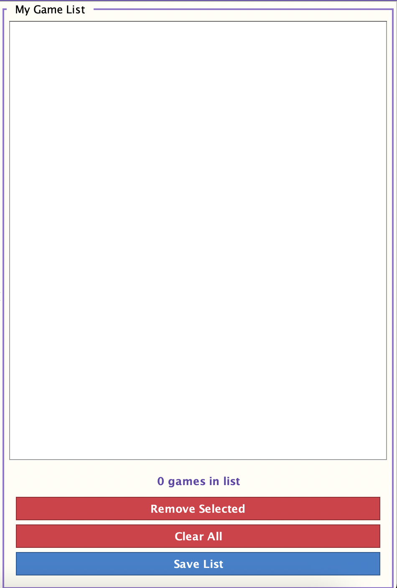

---

## Test 9: Save My Game List

I wanted to test that the save button opens a proper file dialog and that the file contents are correct.

I added some games to My Game List then clicked Save List. I chose the Desktop as the location and kept the default filename games_list.txt.

I expected a file chooser to open with the correct title and default filename, and the saved file to contain each game name on its own line sorted A to Z.

The dialog opened correctly. After saving, opening the file confirmed the names were saved one per line in alphabetical order.

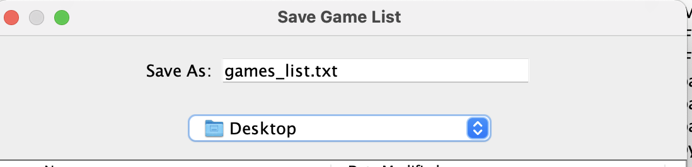

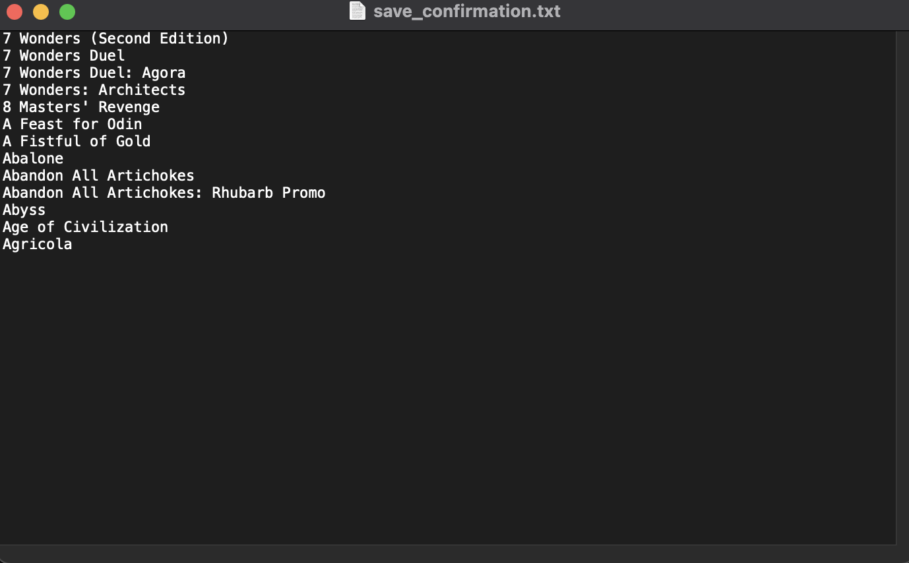
